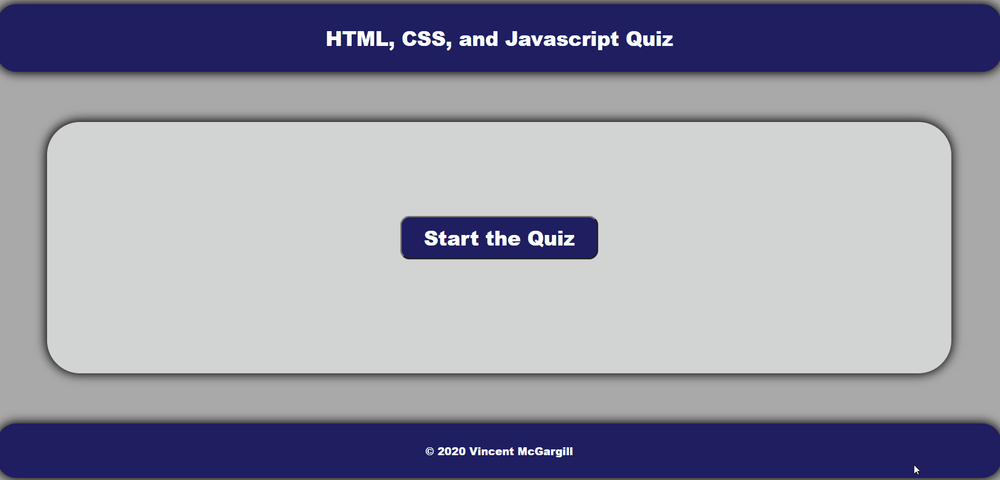

# 04 Web APIs: Code Quiz

In this assignment, I have built a responsive timed quiz that 
scores the user out of 100%. The quiz keeps track of the 
user's score and user's high score and even updates the high 
score when they beat their previous high score. Each question 
is timed for 10 seconds, which can be adjusted if needed. The 
JavaScript code is built in a way where if you just go into 
the questions array and start adding question objects then 
the app updates everything else automatically like the number 
of questions and the total percentage.

# File Scope

```
The scripts.js file holds all of the magic behind this 
application and makes it work.  The index.html file stores 
the location of all the div containers. The Assets/styles.
css  file styles the app to make it look fancy and unique.
```

# JavaScript Code

```
The scripts.js file has the most important code in this 
entire application, otherwise we would not have a quiz that 
is timed, we would just have a pointless HTML radio list and 
a couple of fancy buttons that to nothing. See below for the 
JavaScrip code explained.
```

## Constant HTML Elements

```
Under the Constant HTML Elements section we are creating 
constant variables by getting all  of the HTML elements in 
index.html by their unique ID's by using document.
getElementById().  This comes in handy later down the line so 
that we already have all of our HTML elements  pulled so we 
can update the CSS and hide or unhide containers by changing 
the element classes.
```

## Global Variables

```
In the global variables section we have a few set varaibales 
and lets defines. That way  we can set the default user score 
to 0, the default high score to 0, the quiz question  index 
to 0, it makes the user answer an empty varaiable that we can 
change later, it  sets the default quiz timer to 10 seconds, 
and it creates a timeinterval variable that  can be changed 
later. The purpose of defining these variables as global is 
that we want  to be able to change and redefine them later on 
in multiple functions. This allows us  to reset the time for 
each quesions, change the user answer everytime a new 
question  starts, and update the user score at the end of 
every game, and update the user high score  after the first 
quiz or after the user beats their previous high score. 
```

## Questions Array

```
The Questions Array holds all of our question objects that 
will be used on the quiz app.  These objects hold the 
questions themselves, all available options for answers, and 
the  correct answer. These question objects are pulled in the 
GenerateGuestion() function based  on the current Question 
Index (qIndex). For security purposes, it is not a best 
practice  to store your questions and answers on the local 
JavaScript code otherwise the user could cheat and access the 
source code by using the inspect element feature on a web 
browser. They  could just find all of the answers for the 
Quiz. So if we were to build this quiz for Denver University 
so they could use it to quiz their students in online 
courses, we would not do this and instead we would store the 
answers in a remote server, give only the questions to the 
user, have the user answer the questions and submit the quiz, 
then grade the quiz behind the scenes on a server, then send 
the user the results afterwards.
```

## Question Timer

```
The Quiz Timer is just a simple setTime() function that 
replicates the timer that they showed us in class. It takes 
the global QuestionTimer and starts a 10 second timer that 
counts down  at the begining of every question. Once the 
timer goes off, then the submit button is  automatically 
clicked to submit whatever answer that the user had selected. 
Alternatively,  you could build this to count down for the 
entire quiz. But I decided to make it 10 seconds  per 
question to ramp up the quiz difficultyand to make it so that 
we can add more question  objects to the questions array 
while thetotal time avaialable to complete the quiz 
automatically updates per question added/removed.  
```

## Start Quiz

```
The Start Quiz function hides the defult front page and then 
shows the quiz form. Then it  activates the GenerateQuestion
(qIndex) funtion starting at the first question in the index.
```

## Generate Question

```
The Generate Questions function takes the current question 
index to determine the current question. Then it sets all of 
the input values and lable values in according to the  
current question object. The timer is also activated for the 
first time in this function, and it is reactivated everytime 
the user starts a new quiz or starts a new question. There is 
a Submit Answer Button onClick listener function within this 
Generate Question function, and it is called the CheckAnswer
() function. The CheckAnswer() takes the current input that 
the user has selected and checks if it is the right answer. 

- If the user chose the right answer then it will display a 
green message saying the answer is correct. 

- If the user chose the wrong answer then it will display a 
red message saying they got the answer wrong. 

- If the timer runs out and the user had the correct answer 
selected then it will display a green message saying the user 
had the correct answer selected and they are still rewarded a 
point.

- If the timer runs out and the user had the wrong answer 
selected then it will display a red message saying the user 
had selected the wrong answer.

- If the timer runs out and the user did not have a answer 
selected OR they clicked the submit button with selecting an 
answer then it will display a red message saying sorry but 
you did not chose an answer and then it shows the correct 
answer.

The Check Answer function also checks which question it is on 
in the question index. If the current question index is the 
last question then it will hide the next question button and 
show the end game button. 
```

## Next Question

```
The Next Question function is where the question loop magic 
happens and the current question index is updated. If the 
user is on the last question then question index is update 
and the next question is generated. If the user is on the 
last question in the index then the next question is not 
generated and instead the user's only option is to end the 
quiz. This function also resets the show correct answer 
classes and hides the correct answer div, hides the next 
question button, an reveals the submit answer form to show 
the next question.
```

## Cancel Quiz

```
The cancel quiz button enables the user to stop the quiz and 
start over any time during the quiz. The score is still 
recorded and the timer is reset. This is accomplished by 
running the End Quiz function within this function.
```

## End Quiz

```
The End Game function hides all of the answer elements and 
shows the start game button. It also shows the high score div 
after the quiz is over so the user may view their current 
high score. It also records the users score, alerts the user 
of their score, and shows the user their current high score 
on the home page. This function also runs the UpdateCache 
function which updates the current game cache so the user may 
start a new game if they want to beat their high score.
```

## Update Cache

```
The Update Cache function resets the current user score to 0 
so that if the user starts over an starts a new quiz session, 
their score is not looped over from the previous results. It 
also resets the quiz index to 0 so the user may start a new 
quiz and the question timer is also reset so the timer does 
not loop over and continue during the next quiz section with 
a defult value of 0.
```

The following gif shows the application that I builf for this assignment:



© 2020 Vincent J. McGargill All Rights Reserved.